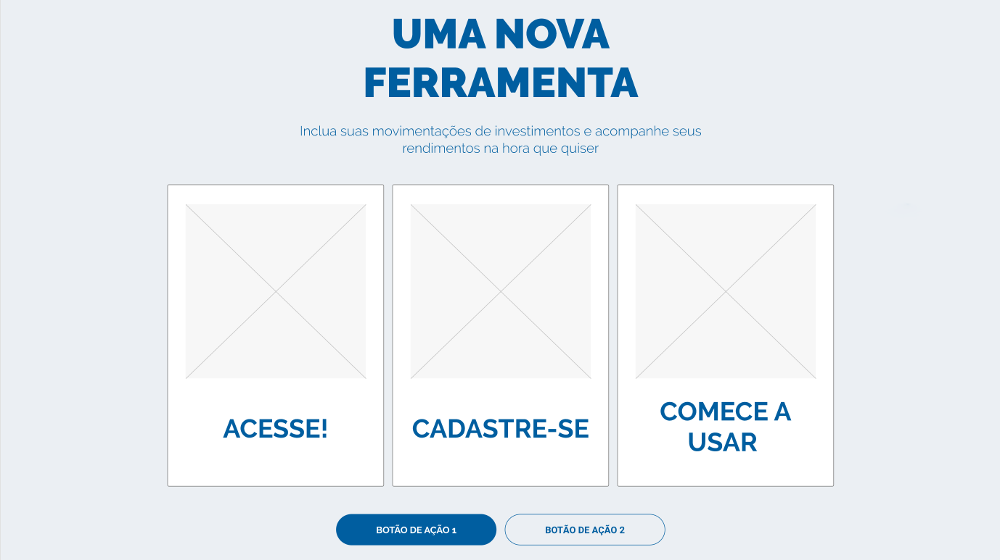
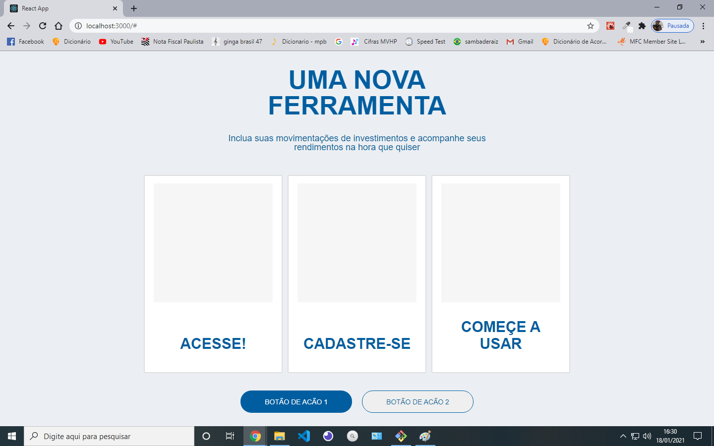

# Desafio comdinheiro

## Layout

## Minha aplicação

## Passos para rodar o app

1. ### `npm install`

   Para instalar as dependências.

2. ### `npm start`
   Para rodar em modo de desenvolvimento.\
   Abra [http://localhost:3000](http://localhost:3000) para ver no browser.
